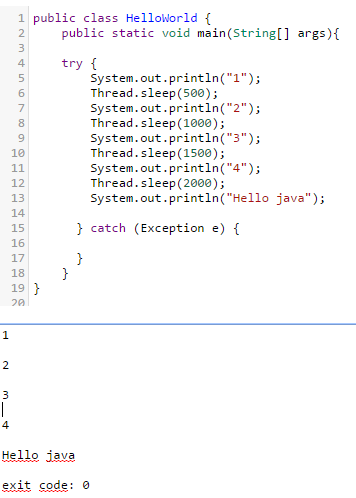

java.js
===============

Execute java code on browser. It's async.. thx express.io

install
------------------

	npm install
	
usage
------------------

	node app
	
and open browser go http://127.0.0.1:1234 type some java and execute it.

